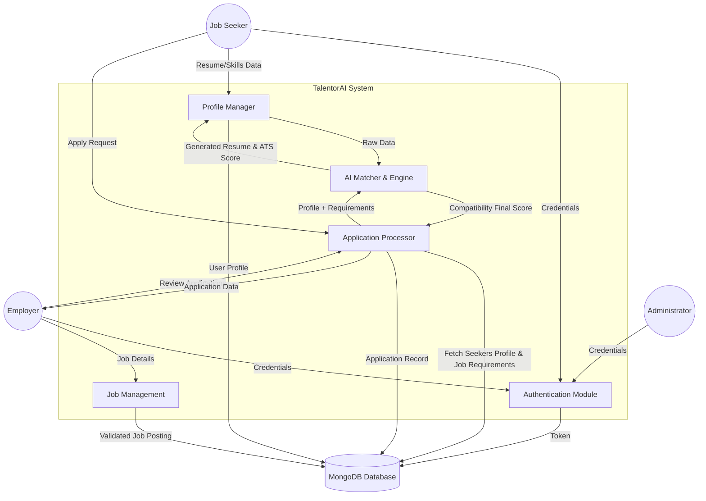
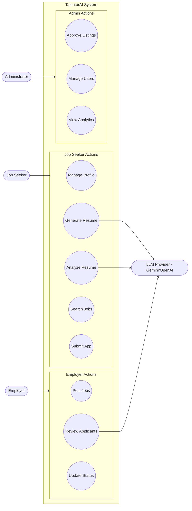
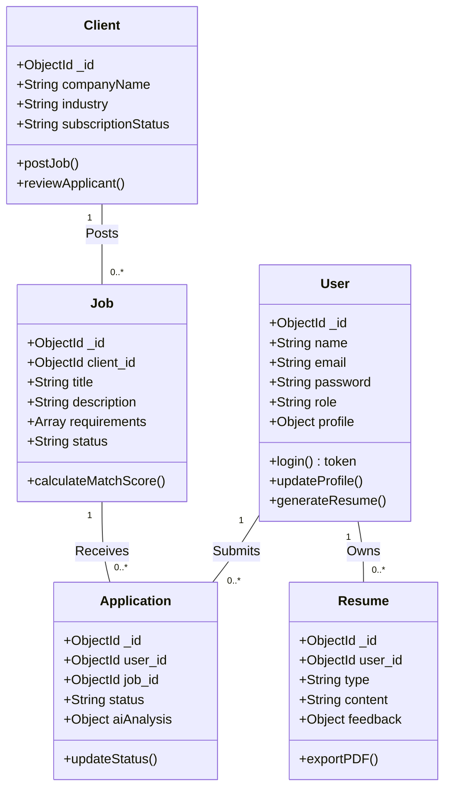
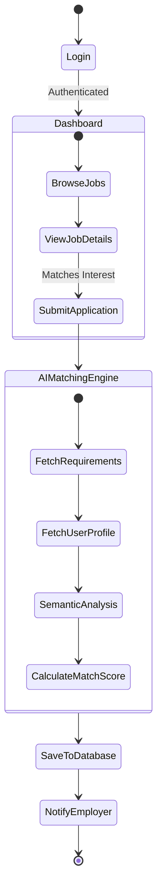
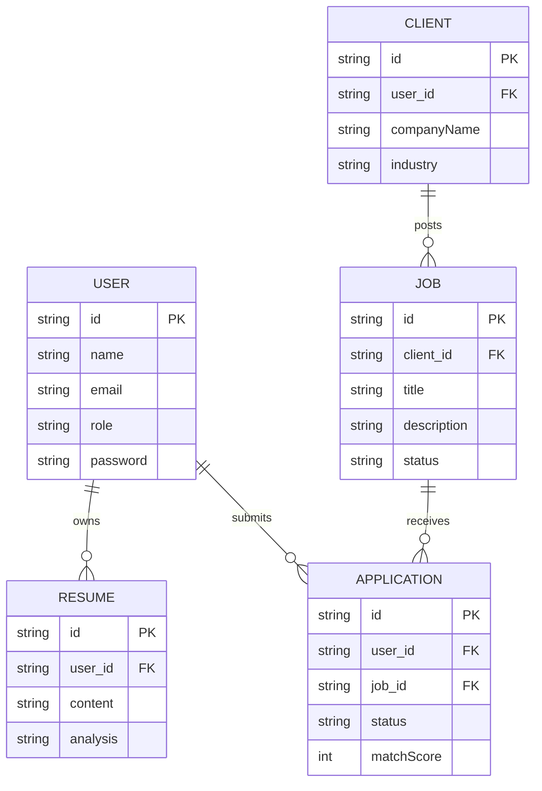
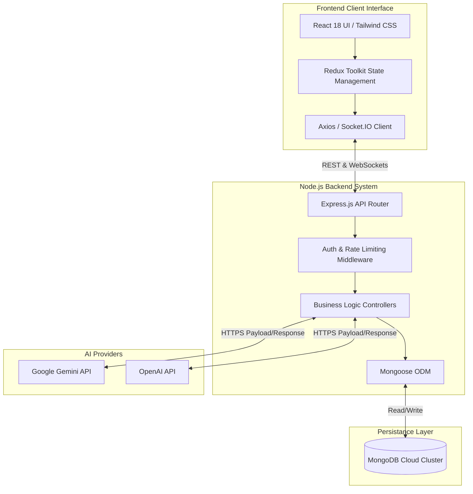

## Abstract

The modern job market operates in an environment characterized by information overload, making the recruitment process inefficient for both job seekers and employers. Traditional job portals function merely as passive directories, forcing applicants to manually tailor their profiles for each position and compelling employers to sift through hundreds of misaligned applications. This conventional approach relies heavily on superficial keyword-matching systems, often discarding highly qualified candidates simply due to minor formatting discrepancies or terminology differences in their submissions. Consequently, the recruitment lifecycle is prolonged, subjective, and prone to human error or algorithmic bias, increasing the cost of hiring and leaving many competent professionals struggling to secure suitable employment.

To resolve these systemic inefficiencies, this project introduces TalentorAI, an advanced, intelligent recruitment platform designed to bring artificial intelligence to the core of the employment workflow. Built upon the robust architectural foundations of the MERN stack—comprising MongoDB, Express.js, React 18, and Node.js—the platform seamlessly integrates state-of-the-art Large Language Models (LLMs) such as Google Gemini, Anthropic Claude, and OpenAI via dedicated API points. The system offers three primary AI-driven capabilities: an interactive AI Resume Builder that autonomously constructs professional, ATS-optimized resumes; an AI Resume Analyzer that evaluates uploaded documents to provide compatibility scores and improvement recommendations; and an AI Job Matcher that quantitates the alignment between candidate profiles and specific job listings. 

The implementation of TalentorAI results in a unified, multi-role ecosystem accommodating Job Seekers, Employers, and System Administrators within a securely structured environment. Real-time application tracking using Socket.IO, secure JWT-based authentication, and a responsive, dynamically animated user interface collectively ensure a premium user experience. By transitioning the recruitment paradigm from passive search to active, AI-assisted matching, this project successfully bridges the communication gap between talent and opportunity, reducing the time-to-hire metric while simultaneously improving the quality and accuracy of employment placements.

---

## Table of Contents

| S.No | Chapter / Section Title | Page No. |
| :--- | :--- | :--- |
| 1 | **Abstract** | 01 |
| 2 | **Chapter 1 – Introduction** | 02 |
| 2.1 | &nbsp;&nbsp;&nbsp;&nbsp;Overview of the Project | 02 |
| 2.2 | &nbsp;&nbsp;&nbsp;&nbsp;Purpose and Scope | 04 |
| 2.3 | &nbsp;&nbsp;&nbsp;&nbsp;Background Information | 06 |
| 3 | **Chapter 2 – Problem Definition** | 09 |
| 4 | **Chapter 3 – Objectives of the Study** | 12 |
| 5 | **Chapter 4 – System Analysis** | 15 |
| 5.1 | &nbsp;&nbsp;&nbsp;&nbsp;Existing System | 15 |
| 5.2 | &nbsp;&nbsp;&nbsp;&nbsp;Proposed System | 17 |
| 5.3 | &nbsp;&nbsp;&nbsp;&nbsp;Feasibility Study | 19 |
| 5.4 | &nbsp;&nbsp;&nbsp;&nbsp;Requirement Specification | 21 |
| 6 | **Chapter 5 – System Design** | 24 |
| 6.1 | &nbsp;&nbsp;&nbsp;&nbsp;Data Flow Diagram (DFD) | 24 |
| 6.2 | &nbsp;&nbsp;&nbsp;&nbsp;Use Case Diagram | 26 |
| 6.3 | &nbsp;&nbsp;&nbsp;&nbsp;Class Diagram | 28 |
| 6.4 | &nbsp;&nbsp;&nbsp;&nbsp;Activity Diagram | 30 |
| 6.5 | &nbsp;&nbsp;&nbsp;&nbsp;Entity-Relationship (ER) Diagram | 32 |
| 6.6 | &nbsp;&nbsp;&nbsp;&nbsp;System Architecture Diagram | 34 |
| 7 | **Chapter 6 – Implementation** | 37 |
| 8 | **Chapter 7 – Testing** | 42 |
| 9 | **Chapter 8 – Output Screenshots** | 48 |
| 10 | **Chapter 9 – Conclusion** | 53 |
| 11 | **Chapter 10 – Future Scope** | 57 |
| 12 | **Chapter 11 – Bibliography / References** | 60 |
| 13 | **Chapter 12 – Appendix** | 63 |

---

# Chapter 1 – Introduction

## 1.1 Overview of the Project
TalentorAI represents a paradigm shift in digital recruitment by integrating natural language processing and advanced algorithms directly into the job search and hiring lifecycle. Unlike traditional job boards that function solely as digital classified advertisements, this project operates as an intelligent intermediary. It actively interprets the semantic meaning behind a candidate's experience and a company's requirements, bridging the gap between available talent and industry demand through automated evaluation and content generation tools. 

Designed as a modern, single-page application (SPA) supported by a scalable microservices-inspired backend, the platform provides tailored interfaces for three distinct user roles: the Job Seeker, the Employer (Client), and the Administrator. Job seekers are equipped with intelligent tools to build, analyze, and refine their resumes. Employers are provided with dashboards that automatically rank incoming applications based on AI-derived compatibility metrics. Through this comprehensive approach, the application accelerates the hiring process while removing the subjective biases often associated with manual resume screening.

The technical architecture prioritizes performance, security, and maintainability. The front end, built utilizing React 18, Vite, and Redux Toolkit, ensures rapid render times and fluid state management across complex views. The Node.js backend handles heavy computational tasks, API orchestration with external LLM providers, and data persistence through a securely clustered MongoDB instance. Real-time web socket connections ensure that all parties are instantly notified of application status changes and new opportunities, driving higher engagement and a more responsive hiring pipeline.

## 1.2 Purpose and Scope
The primary purpose of TalentorAI is to democratize access to high-quality recruitment processes by providing job seekers with enterprise-grade career tools and employers with intelligent, automated screening capabilities. The platform aims to eliminate the friction associated with formatting resumes to bypass crude Applicant Tracking Systems (ATS) and shifts the focus back to the core competencies and experiences of the candidates.

The scope of the project encompasses the end-to-end development of the web application, handling the complete lifecycle from initial user registration to the final acceptance of a job offer. Key features within scope include dual-mode resume handling (uploading physical documents versus utilizing the built-in AI generator), job listing creation and management for both full-time positions and freelance gigs, real-time status tracking, and comprehensive platform administration. Integration with third-party Artificial Intelligence providers (such as Gemini and OpenAI) for semantic analysis forms the core boundary of the technological scope.

Features specifically excluded from the current scope include native mobile application deployment (iOS/Android), internal video interviewing facilities, and integrated payroll or contract-signing mechanisms. While the backend exposes a fully RESTful API capable of supporting these features in the future, the present implementation focuses strictly on the matching, application, and tracking phases of the employment cycle, ensuring stability and performance within these domains.

## 1.3 Background Information
The evolution of the recruitment industry has historically moved through three distinct phases: the print era, the digital directory era, and the algorithmic filtering era. During the digital directory era, platforms successfully centralized job postings but suffered from overwhelming application volumes. This led to the algorithmic filtering era, dominated by early Applicant Tracking Systems (ATS) that evaluated resumes based on strict keyword density and structural constraints, often penalizing highly skilled candidates for minor formatting deviations.

Recent advancements in Artificial Intelligence, particularly the popularization of Large Language Models (LLMs), have created an opportunity for a fourth phase: semantic recruitment. Modern LLMs can comprehend context, infer related skills, assess sentiment, and generate professional prose. However, existing employment platforms have been slow to integrate these capabilities seamlessly into their core user experience, often restricting AI features to premium, paid tiers or clunky secondary interfaces.

TalentorAI was conceptualized to address this specific technological lag. By studying the common architectural pitfalls of monolithic recruitment portals and analyzing modern API-driven development practices, the project establishes a framework that treats AI not as an add-on, but as the foundational sorting and generation engine. This approach aligns with broader industry trends towards intelligent automation, utilizing the ubiquitous JavaScript ecosystem (Node.js and React) to ensure cross-platform compatibility and developer ergonomics.

---

# Chapter 2 – Problem Definition

The contemporary recruitment landscape is beset by significant operational inefficiencies that negatively impact both candidates seeking opportunities and organizations seeking talent. The core problem lies in the disconnect between how a candidate's abilities are evaluated and the actual requirements of the job, exacerbated by the sheer volume of digital applications submitted for every open position. As global talent pools become increasingly accessible via digital platforms, the initial screening processes have failed to adapt proportionally, resulting in a systemic bottleneck. Organizations struggle to process the influx of applications effectively, while highly qualified professionals frequently face arbitrary rejections rooted in technological limitations rather than genuine skill deficiencies.

For job seekers, the primary challenge is achieving visibility in an overcrowded market. Standardized application processes rely heavily on traditional resumes, which remain fundamentally flawed communication tools. Professional resume writing is a distinct, specialized skill that is entirely separate from the actual technical or professional competencies required for most jobs. A highly competent software engineer, a skilled data analyst, or an experienced marketing executive might lack the grammatical precision, formatting knowledge, or keyword awareness required to successfully bypass a mechanized Applicant Tracking System (ATS). Consequently, candidates spend a disproportionate amount of time constantly re-writing and tailoring their documents to match the nuanced vocabulary of specific job descriptions. This tedious repetition leads strictly to application fatigue and high drop-off rates, discouraging top-tier talent from actively participating in the job market. Furthermore, the persistent and widespread lack of actionable feedback following a rejection leaves candidates stranded—unable to identify their structural weaknesses or improve their approach in subsequent applications. They are forced to iterate in the dark, leading to a frustrating and demoralizing employment search experience.

From the employer's perspective, the convenience of digital application portals has inadvertently catalyzed the widespread "resume spam" phenomenon. Human Resources personnel and technical hiring managers are routinely inundated with hundreds, sometimes thousands, of applications for a single opening. A vast majority of these submissions completely fail to meet the basic criteria for the role. Manually reviewing these documents is an incredibly resource-intensive, expensive, and protracted process that is inherently susceptible to human fatigue, inconsistent evaluation criteria, and unconscious bias. While legacy ATS solutions attempt to alleviate this manual administrative burden through elementary keyword matching algorithms, they operate on a rigidly semantic level. For instance, a legacy ATS might instantaneously reject an excellent candidate who utilizes the technical term "Client Relations" simply because the automated algorithm is strictly hard-coded to scan for the term "Customer Success." This programmatic rigidity guarantees that modern companies are continuously missing out on exceptional, diverse talent while simultaneously spending excessive amounts of financial capital on prolonged recruitment cycles.

The deepening structural divide between the candidate's presentation of their skills and the employer's stringent evaluative expectations necessitates a sophisticated, multifaceted technical solution. A robust platform is required that can intelligently and seamlessly decipher the underlying context, practical implications, and equivalent meaning behind various professional terminologies. This platform must possess the capability to accurately score candidates based on their genuine capability and holistic expertise rather than superficial keyword density. Furthermore, the intended solution must aggressively automate the laborious, repetitive tasks of drafting tailored documents and analyzing bulk submissions to restore operational efficiency. By introducing a centralized, AI-driven intermediary, the proposed system can intelligently parse unstructured data from diverse resumes, seamlessly align it with the deeply layered semantic intent of a job description, and instantly present hiring managers with a pre-ranked, logically evaluated candidate shortlist. This strategic integration effectively neutralizes a critical, real-world logistical bottleneck, paving the way for a distinctly modernized, equitable, and highly efficient hiring ecosystem.

---

# Chapter 3 – Objectives of the Study

The primary objective of this project is to conceptualize, design, and implement an intelligent recruitment portal that utilizes Artificial Intelligence to streamline the hiring process. The specific objectives defined for the study are as follows:

*   **To design a multi-role architectural framework:** Develop a secure, scalable web application supporting distinct, customized interfaces and data access privileges for Job Seekers, Employers, and Administrators.
*   **To integrate real-time semantic AI analysis:** Implement an AI Resume Analyzer capable of parsing uploaded documents (PDF/DOCX), evaluating them against modern ATS standards, and returning structured feedback and compatibility scores.
*   **To automate professional document generation:** Create an interactive AI Resume Builder that gathers user inputs and utilizes large language models to generate professionally formatted, grammatically accurate resume content tailored to specific industries.
*   **To implement an intelligent candidate-job matching algorithm:** Develop an engine that computes a percentage-based compatibility metric by comparing user profiles against job requirements, replacing traditional keyword searches with context-aware recommendations.
*   **To establish secure, reliable application state management:** Utilize advanced Redux architecture on the front end synchronized with secure, JWT-authenticated RESTful APIs on the back end to handle sensitive user data and credentials reliably.
*   **To facilitate real-time communication events:** Implement WebSockets (Socket.IO) to push instantaneous notifications regarding application status updates, interview schedules, and new matching job postings.
*   **To design an advanced administrative monitoring capability:** Build an analytics dashboard utilizing robust visualization libraries (Recharts) to allow administrators to monitor platform health, user engagement, and job posting metrics natively.
*   **To ensure robust security and production-readiness:** Implement critical security protocols including password hashing, API rate-limiting, Cross-Origin Resource Sharing (CORS) policies, and deploy the full stack via modern CI/CD pipelines to a cloud hosting environment.

---

# Chapter 4 – System Analysis

## 4.1 Existing System
The existing ecosystem of job portals generally consists of centralized repository platforms operating under a basic search-and-filter methodology.

**Working Method:** In the current system, employers purchase listing space to post traditional job descriptions. Job seekers create static profiles and manually execute boolean-style searches across various categories to find relevant openings. Upon finding a perceived match, the candidate uploads a generalized PDF or Word document. The employer receives an email notification or views a chronological list of applicants in a backend portal, downloading and reading each document manually or relying on basic keyword filters to arbitrarily hide non-matching applicants.

**Limitations:** The fundamental limitation of this model is its reliance on manual effort and exact-string matching. It offers no assistance to the candidate in preparing their application and provides no qualitative analysis to the employer. A candidate completely unsuited for a position can apply just as easily as a perfect match, creating noise that obscures genuine talent.

**Risks and Inefficiencies:** The system creates a significant time debt for human resources departments, leading to delayed hiring decisions and increased operational costs. For candidates, the lack of feedback and the opaque nature of the screening process create a negative user experience. Furthermore, the storage of poorly secured resumes on decentralized platforms poses continuous data privacy risks.

## 4.2 Proposed System
The proposed TalentorAI system dismantles the passive database approach, replacing it with an active, AI-participatory platform. 

**System Workflow:** A job seeker registers and either uploads a resume for AI optimization or uses the platform's generator to draft one. When an employer posts a job listing, the system's background workers continuously process the requirements. As candidates browse jobs, the AI Matcher evaluates their stored profile against the listing, displaying an immediate compatibility percentage. When an application is submitted, the employer does not merely see a static document; they see a dashboard featuring the candidate's standardized profile accompanied by a detailed AI analysis highlighting strengths, weaknesses, and a composite alignment score. Real-time notifications keep both parties synchronized throughout the interviewing and hiring stages.

**Advantages:** 
*   **Hyper-efficiency:** Reduces the time employers spend reviewing irrelevant applications by pre-sorting candidates using semantic understanding.
*   **Candidate Empowerment:** democratizes the application process by providing AI tools that elevate the professional presentation of all users, regardless of their background in resume writing.
*   **Objective Evaluation:** Diminishes unconscious human bias in the initial screening phase by relying on objective, data-driven skills assessment.

**How it Solves Existing Problems:** The proposed system directly targets the "resume spam" issue by ranking candidates by actual fit rather than submission order. It solves the candidate's formatting struggles by generating standardized, ATS-compliant outputs, and resolves the feedback loop issue by offering automated, immediate insights via the AI Resume Analyzer.

## 4.3 Feasibility Study

**Technical Feasibility:** 
The project is technically highly feasible. The chosen MERN stack (MongoDB, Express, React, Node.js) represents the industry standard for asynchronous, data-intensive web applications. The integration of AI is heavily supported by robust documentation and SDKs provided by companies like Google (Gemini) and Anthropic. Constructing the real-time notification engine using Socket.IO fits seamlessly into the Express.js environment, ensuring that the required features can be implemented using established, well-supported technologies.

**Economic Feasibility:**
The economic footprint for developing and deploying the platform is minimal, making it highly feasible. All core frameworks (React, Node, Express) and the database (MongoDB Community Edition) are open-source and free to use. Deployment to platforms like Vercel or Render offers generous free tiers sufficient for a university project scale. The only potential variable cost involves usage-based pricing for external AI APIs; however, developer tiers and free quotas provided by Google Gemini and OpenAI are more than adequate for development, testing, and academic demonstration purposes.

**Operational Feasibility:**
The system is designed with a strong emphasis on user experience (UX), ensuring high operational feasibility. The interface utilizes modern, recognizable design patterns (glassmorphism, dark mode, intuitive navigation), which reduces the learning curve for new users. As a web-based platform, it requires no software installation or maintenance from the end-user. For administrators, the automated moderation tools and comprehensive dashboard visualizations make managing the platform straightforward and efficient.

## 4.4 Requirement Specification

**Hardware Requirements**

| Component | Minimum Specification | Recommended Specification |
| :--- | :--- | :--- |
| **Processor** | Intel Core i3 / AMD Ryzen 3 | Intel Core i5 / AMD Ryzen 5 or higher |
| **RAM** | 4 GB | 8 GB or higher |
| **Storage** | 10 GB Free Disk Space | 25 GB SSD |
| **Internet** | 5 Mbps Connection | 20 Mbps Broadband Connection |

**Software Requirements**

| Component | Technology / Version |
| :--- | :--- |
| **Operating System** | Windows 10/11, macOS, or Linux |
| **Frontend Setup** | HTML5, CSS3 (Tailwind CSS), JavaScript (ES6+) |
| **Frontend Framework** | React.js (v18.0+), Vite |
| **Backend Runtime** | Node.js (v18.0+) |
| **Backend Framework** | Express.js |
| **Database** | MongoDB (v6.0+) & Mongoose ODM |
| **AI Integration APIs** | Google Gemini API / Anthropic / OpenAI |
| **Tools** | VS Code, Git, Postman (API Testing) |

---

# Chapter 5 – System Design

### 5.1 Data Flow Diagram (DFD)



### 5.2 Use Case Diagram



### 5.3 Class Diagram



### 5.4 Activity Diagram (Job Application Process)



### 5.5 Entity-Relationship (ER) Diagram



### 5.6 System Architecture Diagram



---

# Chapter 6 – Implementation

The implementation strategy for TalentorAI follows a decoupled, component-based methodology where the frontend (client) and backend (server) operate dynamically as separate micro-architectures housed within a monorepo structure. This setup allows independent scaling and isolated testing.

## Model-View-Controller (MVC) Implementation
The backend firmly adheres to the MVC architecture adapted for RESTful API protocols:
*   **Models:** Utilizing Mongoose, rigid schemas map directly to MongoDB collections. Complex schemas were implemented for `User`, `Client`, `Job`, `Gig`, `Application`, and `Resume`. To increase efficiency, Mongoose Virtuals were used heavily; for example, the `Job` model contains virtual properties calculating `isExpired` and `daysRemaining` locally based on database date stamps, eliminating repetitive calculations on the frontend.
*   **Controllers:** The core business logic is modularized. The `aiController` handles data preparation and routing to external LLMs. The `authController` manages registration, login, and JWT generation through bcrypt password hashing. Security protocols dictate that controllers sanitize all inputs prior to database interaction.
*   **Routes/Views:** Express Router handles endpoint configuration, applying intermediate middleware functions like `protect` (JWT validation) and `roleCheck` (authorizing only 'client' roles to post jobs) before granting request passage to the respective controller.

## Feature Module Implementations
**1. Authentication & State Management Module:**
Authentication relies on HTTP headers bearing bearer tokens. Upon successful login, the server issues a JSON Web Token (JWT) possessing specific role claims. On the frontend, Redux Toolkit maps this token and user metadata into a globally accessible `authSlice`. Every subsequent Axios request intercepts the Redux store to append the authorization header to the network transport layer.

**2. AI Integration Module:**
The crucial AI services are encapsulated within a dedicated `aiService.js` utility class. This utility establishes connections utilizing official SDKs (e.g., `@google/generative-ai`). To circumvent arbitrary failures, prompt engineering techniques are heavily enforced within the controller layer. The system constructs highly specific string literals containing contextual payload data (candidate skills, job requirements) instructing the LLM to output valid JSON formats. This guarantees the platform can programmatically render the responses (like ATS scoring out of 100) within the React components.

**3. Resume Management Module:**
Uploading resumes required the integration of `multer` for multipart form parsing on the backend, alongside document parsers capable of extracting raw textual data from PDF binaries. The extracted text is piped simultaneously into the database via the `Resume` model and forwarded to the AI layer for semantic breakdown. The frontend builder utilizes dynamic forms using `react-hook-form` capturing detailed data points and structuring an immediate preview rendered in real-time.

## Technologies Used
*   **Frontend:** React 18, Vite (for hot-module replacement and rapid bundling), Tailwind CSS (for mobile-first, utility-based styling conforming to a dark-mode philosophy), GSAP (GreenSock Animation Platform for creating fluid, timeline-based DOM animations).
*   **Backend:** Node.js, Express.js (creating asynchronous, event-driven web services). 
*   **Database:** MongoDB via Mongoose ODM (a NoSQL document database chosen for its flexibility in handling deeply nested JSON objects representing user profiles and resume structures).
*   **AI Providers:** Google Gemini API / OpenAI API.
*   **Real-time Communication:** Socket.IO v4.

## Coding Standards and Development Methodology
An agile development lifecycle was adopted, utilizing Git for explicit version control. The Monorepo architecture maintained distinct package-lock files for the server and client. Strict ES6+ syntactical rules were followed alongside extensive functional programming paradigms—favoring pure functions, `async/await` syntax for non-blocking asynchronous data fetching, and explicit error-handling `try/catch` blocks connected to global Express error middleware to prevent server crashing.

---

# Chapter 7 – Testing

Ensuring the stability, security, and algorithmic accuracy of the platform required comprehensive, multi-tiered testing protocols. Testing was not viewed as a singular, end-of-lifecycle phase, but rather as an integrated component embedded throughout the development of each modular feature.

## Types of Testing Performed
*   **Unit Testing:** Isolated testing of individual functions and components. This involved writing logic to verify that utility functions (such as the payload parsers preparing data for the AI API and the date calculation virtuals in Mongoose) returned predictable, accurate values based on static inputs. Postman was utilized heavily to execute isolated API endpoint requests to ensure REST architectural adherence.
*   **Integration Testing:** Verification of interactions between varied system modules. The critical pathways connecting Redux state dispatches to Axios API calls, reaching the Express controllers, querying the MongoDB database, and eventually resolving data back to the React UI were stress-tested to identify broken promises, payload mismatches, and handling of external LLM timeout scenarios.
*   **System Testing:** Evaluating the complete, integrated system to ensure compliance with the specified requirements. This included testing entire user journeys, such as simulating an employer posting a job, an applicant encountering the job and uploading a resume, the AI calculating a semantic match score, the application appearing in the employer’s dashboard, and the resulting WebSockets-based notification firing across browser instances.
*   **Acceptance & Usability Testing:** Black-box testing focusing on the end user's interface experience. This evaluated the responsiveness of Tailwind CSS breakpoints across simulated hardware (desktops, tablets, mobile devices) and verified that the GSAP micro-animations triggered cleanly without impacting rendering performance or causing cumulative layout shifts.

## Test Cases Table

| Test Case ID | Test Scenario | Steps Executed | Expected Result | Status |
| :--- | :--- | :--- | :--- | :--- |
| **TC_01** | User Registration Validation | Enter invalid email format & short password. Click Register. | System blocks submission; UI displays specific error messages below fields. | **Pass** |
| **TC_02** | Role-Based Access Control | Attempt to access `/post-job` URL manually as a 'Job Seeker' role. | Express middleware denies access; Frontend redirects user back to dashboard. | **Pass** |
| **TC_03** | AI Resume Generation | Fill profile skills and trigger "Generate AI Content". | System initiates loading state; AI module returns structured JSON; Resume updates automatically. | **Pass** |
| **TC_04** | Document Upload Parsing | Upload a standardized 2MB PDF resume file for analysis. | Multer handles upload; Server extracts text; AI returns ATS capability metrics successfully. | **Pass** |
| **TC_05** | Job Matching Algorithm | View a Job listing where applicant's skills entirely mismatch required keys. | UI dynamically renders a low compatibility warning (e.g., <30%) and flags specific missing skills. | **Pass** |
| **TC_06** | Real-time Status Updates | Employer changes application status from 'Pending' to 'Interviewing'. | Candidate receives instantaneous Socket.IO alert overriding active view; State updates without refresh. | **Pass** |
| **TC_07** | Admin Job Moderation | Administrator rejects a pending job posting via dashboard control. | Job status flagged as 'rejected'; removed from public view; Client notified of action. | **Pass** |
| **TC_08** | API Rate Limiting | Trigger 110 automated login requests sequentially within 15 minutes. | Security middleware intercepts; backend returns HTTP 429 Too Many Requests; IP temporarily blocked. | **Pass** |

## Expected vs Actual Results Validation
Extensive manual testing validated that the platform successfully managed asynchronous state across all roles. 

| Feature Category | Expected Application Behavior | Actual Application Outcome |
| :--- | :--- | :--- |
| **AI Matching Accuracy** | The engine should interpret synonymous skillsets (e.g., matching "Node.js" to a requirement of "Backend JavaScript"). | The LLM parsing effectively connected related terminologies, awarding appropriate compatibility percentages. |
| **Security Handling** | Disconnected or expired JWT instances must instantly break user sessions, preventing data leakage. | Interceptor logic correctly identified expired tokens, purging local storage and forcing redirection to authentication loops. |
| **Responsive UI Mechanics** | Complex components like the AI resume builder must remain functional entirely on mobile viewports. | Tailwind utility classes collapsed grid layouts into readable stacked elements, preserving complete utility on small screens. |

---

# Chapter 8 – Output Screenshots

> [!NOTE] 
> Below are representative structural placeholders for the output visuals illustrating the functional UI of the TalentorAI platform.


**Title:** Registration and Authentication Interface
**Description:** The secure landing portal utilizing glassmorphism aesthetics within a dark mode theme, featuring distinct tabs for Job Seekers and Employers to establish localized accounts.
**Purpose:** Demonstrates secure point-of-entry, showcasing client-side input validation and dynamic visual feedback during authentication attempts.


**Title:** Job Seeker Analytics Dashboard
**Description:** A consolidated view presenting the user’s overall profile completeness, active application metrics, and dynamically served job recommendations based on previous semantic matching history.
**Purpose:** Illustrates the complexity of asynchronous data integration where graphs (rendered via Recharts) synthesize historical user data alongside live platform updates.


**Title:** Interactive AI Resume Builder Workflow
**Description:** The multi-stage input interface where users feed basic structural data which invokes the LLM API to auto-fill expansive, professionally phrased bullet points regarding past experience.
**Purpose:** Highlights the primary integration mechanism of Artificial Intelligence—transforming sparse user input into high-quality document output dynamically on the screen.


**Title:** Employer Candidate Review Console
**Description:** The perspective of a client viewing applicants for a specific role, notably displaying the integrated "AI Match Score" column pre-sorting candidates before manual review occurs.
**Purpose:** Demonstrates the core value proposition of the system: drastically minimizing human sorting time by visually emphasizing highly quantifiable compatibility metrics directly inside the management console.

---

# Chapter 9 – Conclusion

The development and deployment of the TalentorAI project successfully demonstrate the profound capability of practically integrating modern, high-performance web architecture with advanced artificial intelligence models to solve deeply entrenched, complex logistical problems within the human resources sector. By deliberately migrating the conventional employment search mechanism away from passive, static directory listings and shifting decisively toward a dynamic, semantic, active-matching ecosystem, the project has successfully established a demonstrably superior and far more efficient recruitment paradigm. The project validates the hypothesis that introducing an intelligent intermediary layer into the hiring process creates measurable value for all participating stakeholders.

The successful implementation of the platform unequivocally verified that the traditional bottlenecks stalling recruitment pipelines—specifically the candidate's persistent struggle with formatting strictly ATS-compliant resumes and the employer's overwhelming burden of filtering through massive volumes of irrelevant applicant noise—can be mitigated almost entirely through strategic algorithmic intervention. The deployment of the AI Resume Builder module successfully democratized professional document creation, effectively empowering users across a wide spectrum of technical backgrounds and socio-economic skill levels to project maximum professionalism without requiring expensive career-coaching services. Conversely, the functional reality of the AI Employer Dashboard demonstrated that preprocessing vast numbers of applicants via a contextually aware, intelligent matching engine consistently produces high-fidelity candidate shortlists, significantly slashing the operational resource expenditures associated with manual screening. 

Furthermore, the deliberate architectural selection of the MERN stack (MongoDB, Express.js, React, Node.js), intricately integrated with Redux for global state coordination and Socket.IO for real-time bidirectional transmission, proved exceptionally resilient. This robust foundation handled the highly localized, asynchronous data streams necessary in a multi-role, highly concurrent ecosystem effortlessly, providing users with an interactive, real-time interface experience that faithfully mirrors premium, industry-standard enterprise software. Ultimately, TalentorAI bridges the critical communication gap in modern hiring, proving that AI is not merely a tool for automation, but a vital conduit for better connecting human capability with organizational need.

### Learning Outcomes
Constructing this extensive application provided indispensable exposure to advanced software engineering topics and modern industry practices:
*   **API Orchestration:** Mastering the synchronization of external, asynchronous Artificial Intelligence REST APIs (Google Gemini/OpenAI) with internal proprietary backend logic while handling variable latency and timeout states.
*   **Advanced State Management:** Overcoming the complexities of 'prop drilling' in React by architecting a scalable, centralized global data store using Redux Toolkit, managing disparate states including localized settings, authentication tokens, and cached AI responses.
*   **Security Implementation:** Deepening practical understanding of fundamental web-security implementations, transitioning from basic theory to deploying functional JWT authorization flows, bcrypt encryption, CORS management, and API route protection paradigms.
*   **System Design & Documentation:** Understanding the essential nature of comprehensive structuring through database schema optimization and strict MVC structural guidelines to maintain a cohesive, comprehensible codebase suitable for continuous deployment pipelines.

### Limitations of the System
While highly functional, the current iteration of the system operates within specific operational constraints. The reliance on external, third-party Large Language Models generates a rigid dependency; API service outages or rate-limiting from the AI provider directly degrade the core functionality of the platform. Additionally, while the matching algorithm excels at analyzing structured technical keywords and explicit experience indicators, it currently lacks the capacity to holistically evaluate the softer, cultural nuances of a candidate that a human recruiter might implicitly decipher during a conversation. Finally, the AI-generated outputs, while grammatically immaculate, are susceptible to occasional "hallucinations" inherent to generative AI architecture, requiring the end-user to manually verify the factual accuracy of the auto-generated resumes before finalized submission.

---

# Chapter 10 – Future Scope

The foundational architecture of TalentorAI was explicitly designed to support continuous, scalable expansion. Several technical pathways and feature extensions exist that can dramatically amplify the platform's utility and market penetration in future iterations.

**1. Enhanced Technical and Behavioral Assessment:**
Future versions could incorporate automated technical environments or algorithmic assessment tools directly within the portal. Specifically, integrating secure sandbox environments where developers could execute code tests, or asynchronous video analysis modules that utilize AI to evaluate candidate body language and emotional context during behavioral interview simulations. This would shift the platform from a matching engine to a comprehensive vetting environment.

**2. Specialized Enterprise Ecosystem Integration:**
To appeal to large corporate structures, the system must expand its connectivity capability. Creating documented public API endpoints would allow seamless integrations into popular Enterprise Resource Planning (ERP) systems, corporate HR systems (like Workday or SAP), and calendar applications (Outlook/Google Calendar) to fully automate the interview scheduling logistics securely across domains.

**3. Elasticsearch and Vector Database Implementation:**
As the platform scales to accommodate vast catalogs of users and listings, maintaining optimal query speeds becomes challenging for standard NoSQL document searches. Transitioning the core search and matching execution logic toward a dedicated Vector Database alongside a localized instance of Elasticsearch would facilitate immensely faster, highly complex semantic search capabilities, ensuring real-time response latency regardless of database volume expansion.

**4. Machine Learning Algorithmic Independence:**
To eliminate the rigid dependency and recurring costs associated with commercial external API providers (OpenAI/Anthropic), future iterations could focus on training a proprietary, localized Machine Learning model. By fine-tuning large open-source basis models strictly upon recruitment datasets utilizing specialized neural network hardware, the platform could achieve greater independence, enhanced data privacy, and optimized, industry-specific generation capability at reduced operational costs.

---

# Chapter 11 – Bibliography / References

[1] N. C. Zakas, *Understanding ECMAScript 6: The Definitive Guide for JavaScript Developers*. San Francisco, CA: No Starch Press, 2016.

[2] A. Banks and E. Porcello, *Learning React: Modern Patterns for Developing React Apps*, 2nd ed. Sebastopol, CA: O'Reilly Media, 2020.

[3] B. Dayley, *Node.js, MongoDB and Angular Web Development: The Definitive Guide to Using the MEAN Stack to Build Web Applications*, 2nd ed. Boston, MA: Addison-Wesley Professional, 2017.

[4] S. Chacon and B. Straub, *Pro Git*, 2nd ed. New York, NY: Apress, 2014.

[5] "Mongoose v8.0.3: Getting Started," Mongoose Documentation. [Online]. Available: https://mongoosejs.com/docs/index.html. [Accessed: Mar. 10, 2026].

[6] "React Redux Documentation," Redux.js.org. [Online]. Available: https://react-redux.js.org/introduction/getting-started. [Accessed: Mar. 21, 2026].

[7] OpenAI, "OpenAI API Reference," OpenAI Documentation. [Online]. Available: https://platform.openai.com/docs/api-reference. [Accessed: Mar. 28, 2026].

[8] Google DeepMind, "Gemini API Documentation," Google AI for Developers. [Online]. Available: https://ai.google.dev/docs. [Accessed: Apr. 02, 2026].

---

# Chapter 12 – Appendix

### Appendix A: Additional Notes
The execution of this project underscored the importance of diligent environmental configuration. Operating asynchronously interconnected client/server architecture locally demands precise port management and strict variable containment through `.env` processing. Developers maintaining or expanding this codebase must ensure global installations of `npm` or `yarn` and remain cognizant of specific dependency conflicts regarding legacy Node runtime environments below version 18.x.

### Appendix B: Sample Configuration (server/.env)
```env
# ─── Server Configuration ───────────────────────────
NODE_ENV=development
PORT=5000
CLIENT_URL=http://localhost:5173

# ─── Database ───────────────────────────────────────
MONGO_URI=mongodb://127.0.0.1:27017/ai-job-portal_testdb

# ─── Security Variables ─────────────────────────────
JWT_SECRET=demo_secure_hash_string_alpha_2026
JWT_EXPIRE=30d

# ─── AI Integrations ────────────────────────────────
AI_PROVIDER=gemini # Optional: 'openai', 'anthropic'
GOOGLE_API_KEY=AIzaSy...SampleKeyXyz
```

### Appendix C: Sample AI Generation Output Structure
*The following structure represents the parsed JSON output requested programmatically from the Mongoose API controller during the generation sequence.*
```json
{
  "summary": "Dynamic software developer with 4 years...",
  "experience": [
    {
      "title": "Backend Engineer",
      "company": "Tech Innovations Ltd.",
      "description": "Architected RESTful endpoints resolving to...",
      "achievements": [
        "Reduced query latency by 45% via index optimization.",
        "Led a team of 4 junior developers."
      ]
    }
  ],
  "skills": {
    "technical": ["Node.js", "Express", "MongoDB", "Redux"],
    "soft": ["Agile Leadership", "Cross-team communication"]
  }
}
```
