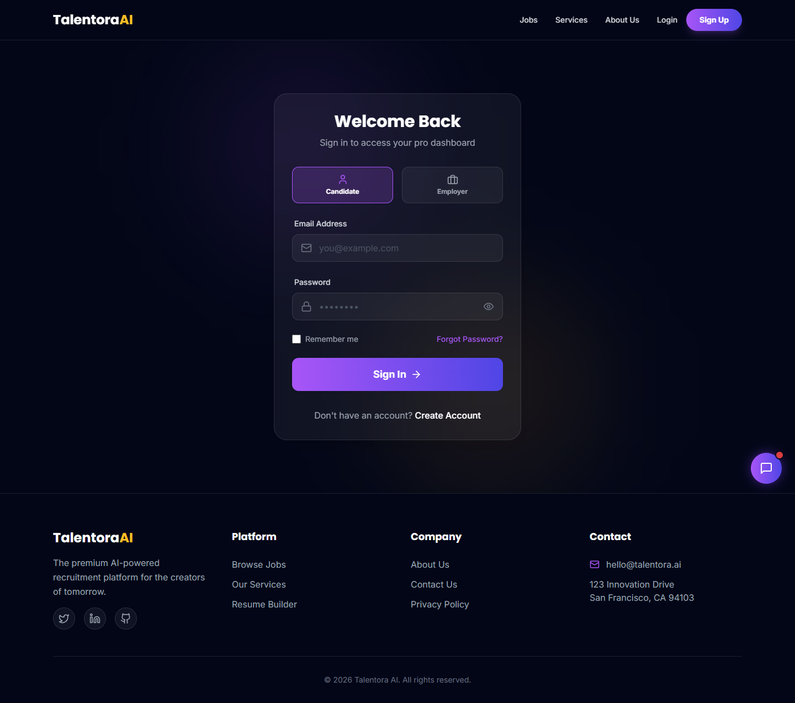
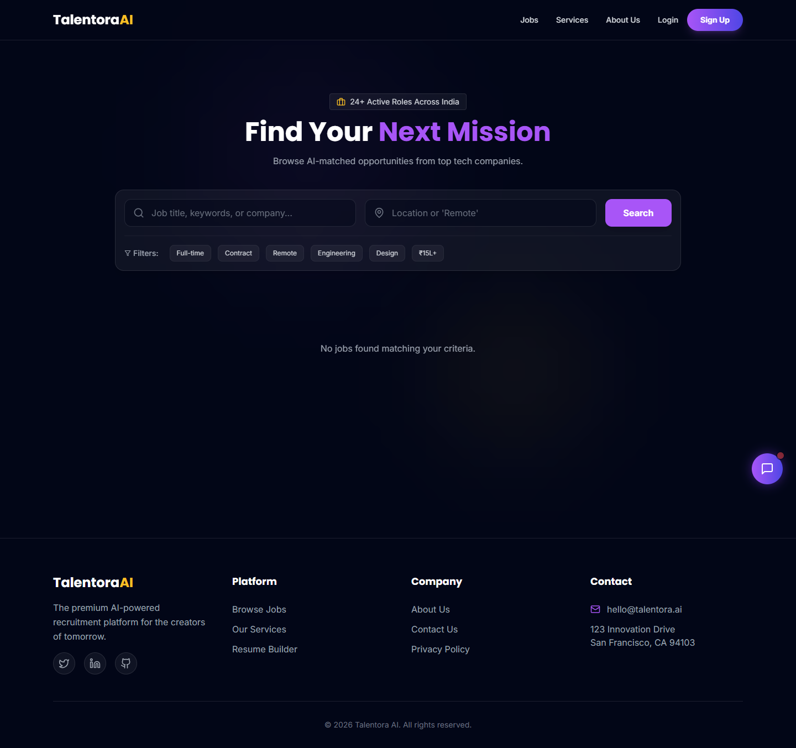
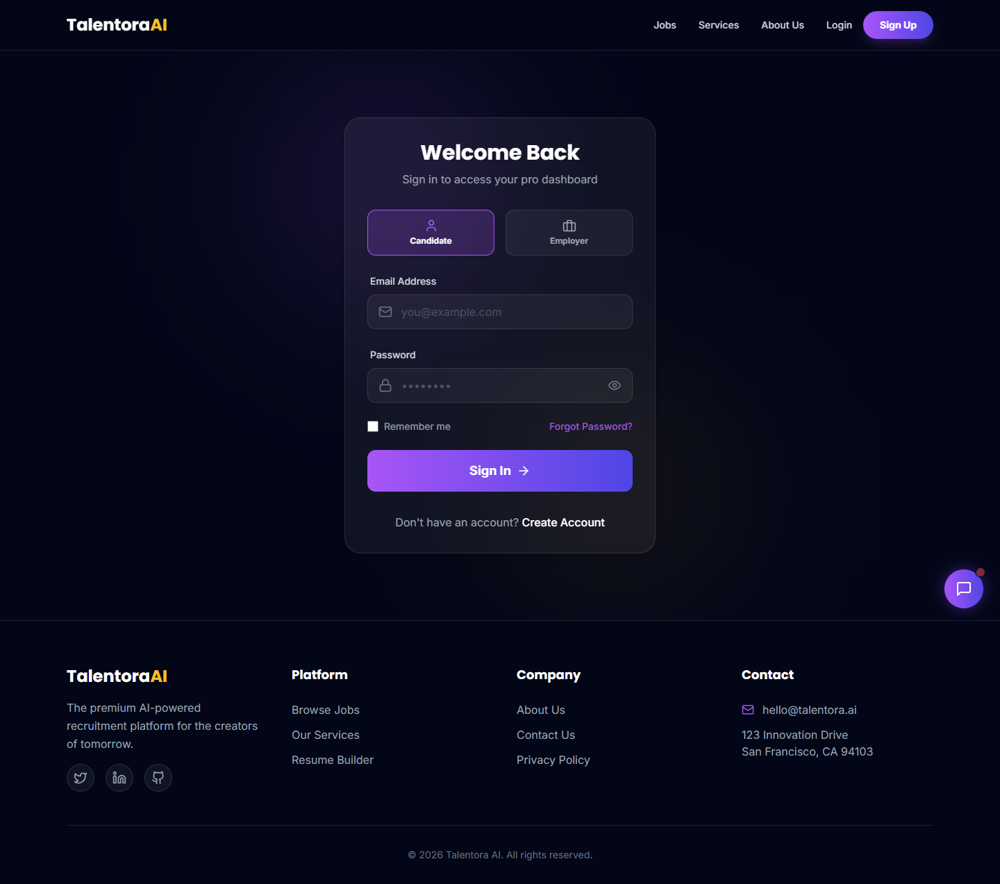

<div align="center">

  

  <br/>
  <br/>

  # 🧠 TalentorAI — Where Intelligence Meets Opportunity

  **The next-generation AI-powered recruitment platform that transforms how talent connects with opportunity.**

  [](https://reactjs.org/)
  [](https://nodejs.org/)
  [](https://www.mongodb.com/)
  [](https://vitejs.dev/)
  [](https://tailwindcss.com/)
  [](LICENSE)

  <br/>

  [🌐 Live Demo (Vercel)](https://talentora-ai.vercel.app/) · [📖 Documentation](#-project-architecture) · [🐛 Report Bug](https://github.com/DeepParekh9190/ai-job-portal/issues) · [✨ Request Feature](https://github.com/DeepParekh9190/ai-job-portal/issues)

  <br/>

  ---

</div>

<br/>

## 🎯 What is TalentorAI?

> *TalentorAI isn't just another job board — it's an **intelligent recruitment ecosystem** powered by AI that understands resumes, matches candidates to roles, and generates professional documents, all from a stunning dark-themed interface.*

TalentorAI bridges the gap between **job seekers**, **employers**, and **administrators** with three AI-powered superpowers:

| 🤖 Feature | What It Does | Who Benefits |
|:---|:---|:---|
| **AI Resume Builder** | Generates professional resumes with AI-crafted content, step-by-step | Job Seekers |
| **AI Resume Analyzer** | Scans uploaded resumes for ATS compatibility, scores, and improvement tips | Job Seekers |
| **AI Job Matcher** | Calculates a compatibility score between candidate profiles and job listings | Job Seekers & Employers |

<br/>

## 📸 Screenshots

<div align="center">
  <table>
    <tr>
      <td align="center"><b>🔐 Login Page</b></td>
      <td align="center"><b>🔍 Job Search & Filters</b></td>
    </tr>
    <tr>
      <td></td>
      <td></td>
    </tr>
    <tr>
      <td align="center"><b>📝 AI Resume Builder</b></td>
      <td align="center"><b>&nbsp;</b></td>
    </tr>
    <tr>
      <td></td>
      <td></td>
    </tr>
  </table>
</div>

<br/>

## 🏗️ Project Architecture

```
┌──────────────────────────────────────────────────────────────────┐
│                        TalentorAI Platform                       │
├──────────────────────────────┬───────────────────────────────────┤
│         🖥️ CLIENT            │           ⚙️ SERVER              │
│                              │                                   │
│  React 18 + Vite 5           │   Node.js + Express.js            │
│  ├── Tailwind CSS            │   ├── config/                     │
│  ├── Redux Toolkit           │   │   └── db.js (MongoDB)         │
│  ├── React Router v6         │   ├── controllers/                │
│  ├── Axios (HTTP)            │   │   ├── authController.js       │
│  ├── Recharts (Analytics)    │   │   ├── aiController.js         │
│  ├── jsPDF (PDF Export)      │   │   ├── jobController.js        │
│  ├── GSAP (Animations)       │   │   ├── gigController.js        │
│  └── Socket.IO Client        │   │   ├── adminController.js      │
│                              │   │   ├── userController.js       │
│  Pages:                      │   │   └── applicationController   │
│  ├── 🏠 Home                 │   ├── models/                     │
│  ├── 📋 About                │   │   ├── User.js                 │
│  ├── 🛎️ Services             │   │   ├── Client.js               │
│  ├── 📞 Contact              │   │   ├── Job.js                  │
│  ├── 🔐 Login / Register     │   │   ├── Gig.js                  │
│  │                           │   │   ├── Application.js          │
│  ├── 👤 User Dashboard       │   │   └── Resume.js               │
│  │   ├── Browse Jobs         │   ├── middleware/                  │
│  │   ├── Apply to Jobs       │   │   ├── auth.js (JWT)           │
│  │   ├── AI Resume Builder   │   │   └── rateLimiter.js          │
│  │   ├── My Applications     │   ├── routes/                     │
│  │   └── Profile             │   │   ├── authRoutes.js           │
│  │                           │   │   ├── aiRoutes.js             │
│  ├── 🏢 Client Dashboard     │   │   ├── clientRoutes.js         │
│  │   ├── Post Jobs/Gigs      │   │   ├── userRoutes.js           │
│  │   ├── My Listings         │   │   └── adminRoutes.js          │
│  │   └── View Applicants     │   └── utils/                      │
│  │                           │                                   │
│  └── 🛡️ Admin Dashboard      │   Security:                       │
│      ├── Manage Users        │   ├── 🔒 Helmet                   │
│      ├── Manage Clients      │   ├── 🛡️ CORS                     │
│      ├── Approve Jobs        │   ├── ⏱️ Rate Limiting             │
│      └── Analytics           │   └── 🔑 bcrypt + JWT             │
│                              │                                   │
├──────────────────────────────┴───────────────────────────────────┤
│                     🗄️ MongoDB Database                          │
│    Collections: users, clients, jobs, gigs, applications,        │
│                 resumes                                           │
├──────────────────────────────────────────────────────────────────┤
│            🧠 AI Engine (Anthropic Claude / OpenAI)              │
│    Resume Generation • Resume Analysis • Job Matching            │
└──────────────────────────────────────────────────────────────────┘
```

<br/>

## ⚡ Tech Stack Deep Dive

<table>
  <tr>
    <th>Layer</th>
    <th>Technology</th>
    <th>Purpose</th>
  </tr>
  <tr>
    <td rowspan="8"><b>🖥️ Frontend</b></td>
    <td></td>
    <td>Component-based UI with hooks</td>
  </tr>
  <tr>
    <td></td>
    <td>Lightning-fast HMR & build tooling</td>
  </tr>
  <tr>
    <td></td>
    <td>Utility-first styling with dark theme</td>
  </tr>
  <tr>
    <td></td>
    <td>Global state management</td>
  </tr>
  <tr>
    <td></td>
    <td>Client-side routing & protected routes</td>
  </tr>
  <tr>
    <td></td>
    <td>Interactive analytics charts</td>
  </tr>
  <tr>
    <td></td>
    <td>Premium scroll & entrance animations</td>
  </tr>
  <tr>
    <td></td>
    <td>Client-side PDF resume export</td>
  </tr>
  <tr>
    <td rowspan="7"><b>⚙️ Backend</b></td>
    <td></td>
    <td>Runtime environment</td>
  </tr>
  <tr>
    <td></td>
    <td>REST API framework</td>
  </tr>
  <tr>
    <td></td>
    <td>NoSQL document database</td>
  </tr>
  <tr>
    <td></td>
    <td>MongoDB ODM with schema validation</td>
  </tr>
  <tr>
    <td></td>
    <td>Stateless authentication</td>
  </tr>
  <tr>
    <td></td>
    <td>Real-time communication</td>
  </tr>
  <tr>
    <td></td>
    <td>File upload handling (resumes)</td>
  </tr>
  <tr>
    <td><b>🧠 AI</b></td>
    <td> /  / </td>
    <td>Resume generation, analysis & job matching</td>
  </tr>
</table>

<br/>

## 🚀 Quick Start

### Prerequisites

| Tool | Version | Check |
|:---|:---|:---|
| Node.js | ≥ 18.x | `node --version` |
| npm | ≥ 9.x | `npm --version` |
| MongoDB | ≥ 6.x | `mongod --version` |
| Git | Latest | `git --version` |

### 1️⃣ Clone & Install

```bash
# Clone the repository
git clone https://github.com/DeepParekh9190/ai-job-portal.git
cd ai-job-portal

# Install all dependencies (root + client + server)
npm run install:all
```

### 2️⃣ Configure Environment

```bash
# Navigate to server and create your .env file
cd server
cp .env.example .env
```

Edit `server/.env` with your credentials:

```env
# ─── Database ───────────────────────────────────────
MONGO_URI=mongodb://localhost:27017/ai-job-portal

# ─── Authentication ─────────────────────────────────
JWT_SECRET=your_super_secret_key_here
JWT_EXPIRE=30d

# ─── AI Provider (pick one) ─────────────────────────
AI_PROVIDER=google
GOOGLE_API_KEY=your_google_api_key_here
# ANTHROPIC_API_KEY=sk-ant-xxxxxxxxxxxxx
# OPENAI_API_KEY=sk-xxxxxxxxxxxxx

# ─── App Config ─────────────────────────────────────
CLIENT_URL=http://localhost:5173
PORT=5000
NODE_ENV=development
```

### 3️⃣ Launch

```bash
# From the root directory — starts both frontend and backend concurrently
npm run dev
```

| Service | URL |
|:---|:---|
| 🖥️ Frontend | [http://localhost:5173](http://localhost:5173) |
| ⚙️ API Server | [http://localhost:5000](http://localhost:5000) |

<br/>

## 🧩 Features by Role

<details>
<summary><b>👤 Job Seeker (Candidate)</b></summary>

<br/>

| Feature | Description |
|:---|:---|
| 🔍 **Browse Jobs** | Search, filter by type (Full-time, Contract, Remote), category, and salary |
| 📝 **One-Click Apply** | Apply to jobs directly through the platform |
| 🤖 **AI Resume Builder** | Step-by-step guided resume creation with AI-generated content suggestions |
| 📊 **AI Resume Analyzer** | Upload PDF/DOCX resumes and receive ATS compatibility scores and feedback |
| 🎯 **AI Job Matching** | See a compatibility percentage for each job based on your profile |
| 📋 **My Applications** | Track the status of all submitted applications |
| 👤 **Profile Management** | Update personal info, skills, and experience |

</details>

<details>
<summary><b>🏢 Employer (Client)</b></summary>

<br/>

| Feature | Description |
|:---|:---|
| 📝 **Post Jobs** | Create detailed job listings with requirements, salary, and benefits |
| 🎯 **Post Gigs** | List freelance/contract opportunities with budgets and timelines |
| 📊 **View Applicants** | Review applications with AI-scored resumes for quick filtering |
| ✏️ **Edit Listings** | Update or remove active job and gig postings |
| 📈 **Dashboard** | Overview of active listings, applications received, and metrics |

</details>

<details>
<summary><b>🛡️ Administrator</b></summary>

<br/>

| Feature | Description |
|:---|:---|
| 👥 **Manage Users** | View, search, and manage all registered job seekers |
| 🏢 **Manage Clients** | View and manage employer accounts |
| ✅ **Approve Jobs** | Review and approve/reject job postings before they go live |
| 📊 **Analytics Dashboard** | Platform-wide stats: registrations, applications, job trends |

</details>

<br/>

## 📡 API Reference

<details>
<summary><b>🔐 Authentication</b> — <code>/api/auth</code></summary>

```http
POST   /api/auth/register       # Create a new account (user/client)
POST   /api/auth/login           # Login & receive JWT token
GET    /api/auth/me              # Get current authenticated user
POST   /api/auth/forgot-password # Request password reset email
```

</details>

<details>
<summary><b>💼 Jobs (User)</b> — <code>/api/user</code></summary>

```http
GET    /api/user/jobs            # Browse all approved jobs (with filters)
GET    /api/user/jobs/:id        # Get single job details
POST   /api/user/apply           # Apply to a job
GET    /api/user/applications    # Get user's applications
GET    /api/user/profile         # Get/update user profile
```

</details>

<details>
<summary><b>🏢 Jobs (Client)</b> — <code>/api/client</code></summary>

```http
POST   /api/client/jobs          # Create a new job listing
GET    /api/client/jobs          # Get my posted jobs
PUT    /api/client/jobs/:id      # Update job listing
DELETE /api/client/jobs/:id      # Delete job listing
GET    /api/client/applicants    # View applicants for my jobs
POST   /api/client/gigs          # Create a gig listing
GET    /api/client/gigs          # Get my gigs
PUT    /api/client/gigs/:id      # Update gig
DELETE /api/client/gigs/:id      # Delete gig
```

</details>

<details>
<summary><b>🧠 AI Services</b> — <code>/api/ai</code></summary>

```http
POST   /api/ai/generate-resume   # Generate resume content with AI
POST   /api/ai/analyze-resume    # Analyze uploaded resume for ATS score
POST   /api/ai/match-job         # Calculate job-candidate compatibility
```

</details>

<details>
<summary><b>🛡️ Admin</b> — <code>/api/admin</code></summary>

```http
GET    /api/admin/users          # List all users
GET    /api/admin/clients        # List all clients
GET    /api/admin/analytics      # Platform analytics data
PUT    /api/admin/jobs/:id/approve  # Approve/reject job posting
DELETE /api/admin/users/:id      # Remove user account
```

</details>

<br/>

## 🔒 Security

TalentorAI implements **enterprise-grade security** across all layers:

```
   ┌─────────────────────────────────────┐
   │         Security Architecture        │
   ├─────────────────────────────────────┤
   │                                     │
   │  🔑 Authentication                  │
   │  ├── JWT tokens (30-day expiry)     │
   │  ├── bcrypt password hashing        │
   │  └── Role-based access (RBAC)       │
   │                                     │
   │  🛡️ API Protection                  │
   │  ├── Helmet (security headers)      │
   │  ├── CORS whitelist                 │
   │  ├── Rate limiting (100 req/15min)  │
   │  └── Input validation (express-     │
   │       validator)                    │
   │                                     │
   │  📁 File Security                   │
   │  ├── Multer file type validation    │
   │  └── 5MB upload size limit          │
   │                                     │
   └─────────────────────────────────────┘
```

<br/>

## 📂 Folder Structure

```
ai-job-portal/
│
├── 📦 client/                          # React Frontend (Vite)
│   ├── public/                         # Static assets
│   ├── src/
│   │   ├── components/
│   │   │   ├── common/                 # Shared components
│   │   │   ├── features/              # Feature-specific components
│   │   │   ├── layout/                # Navbar, Footer, Sidebar
│   │   │   └── ui/                    # Buttons, Cards, Modals
│   │   ├── pages/
│   │   │   ├── Home.jsx               # Landing page
│   │   │   ├── About.jsx              # About page
│   │   │   ├── Services.jsx           # Services page
│   │   │   ├── Contact.jsx            # Contact form
│   │   │   ├── auth/                  # Login & Register
│   │   │   ├── user/                  # Job seeker dashboard
│   │   │   ├── client/                # Employer dashboard
│   │   │   └── admin/                 # Admin dashboard
│   │   ├── redux/                     # Redux Toolkit store & slices
│   │   ├── services/                  # API service layer (Axios)
│   │   ├── routes/                    # Route configuration
│   │   ├── utils/                     # Helper functions
│   │   ├── data/                      # Static data & constants
│   │   ├── App.jsx                    # Root component
│   │   ├── main.jsx                   # Entry point
│   │   └── index.css                  # Global styles
│   ├── index.html
│   ├── vite.config.js
│   ├── tailwind.config.js
│   └── package.json
│
├── ⚙️ server/                          # Node.js Backend (Express)
│   ├── config/                        # Database & app configuration
│   ├── controllers/                   # Route handlers
│   │   ├── authController.js          # Auth logic
│   │   ├── aiController.js            # AI feature logic
│   │   ├── jobController.js           # Job CRUD
│   │   ├── gigController.js           # Gig CRUD
│   │   ├── applicationController.js   # Application management
│   │   ├── userController.js          # User operations
│   │   └── adminController.js         # Admin operations
│   ├── models/                        # Mongoose schemas
│   │   ├── User.js                    # User model
│   │   ├── Client.js                  # Employer model
│   │   ├── Job.js                     # Job listing model
│   │   ├── Gig.js                     # Gig listing model
│   │   ├── Application.js            # Application model
│   │   └── Resume.js                  # AI-generated resume model
│   ├── middleware/                     # Express middleware
│   ├── routes/                        # API route definitions
│   ├── utils/                         # Utility functions
│   ├── scripts/                       # Database seed scripts
│   ├── server.js                      # Server entry point
│   └── package.json
│
├── 📸 screenshots/                     # App screenshots for docs
├── 📄 PROJECT_REPORT.md               # Academic project report
├── 📋 SETUP_INSTRUCTIONS.md           # Detailed setup guide
└── 📖 README.md                       # ← You are here!
```

<br/>

## 🎨 Design Philosophy

TalentorAI features a **premium dark-theme SaaS aesthetic** inspired by modern design trends:

- **🌙 Dark Mode First** — Deep navy-to-purple gradient backgrounds (`#0a0a1a` → `#1a0a2e`)
- **💜 Vibrant Accents** — Purple/violet highlights (`#8B5CF6`) for CTAs, links, and interactive elements
- **✨ Glassmorphism** — Frosted glass cards with backdrop blur effects
- **🎬 Micro-Animations** — GSAP-powered entrance animations, hover effects, and smooth transitions
- **📱 Fully Responsive** — Mobile-first approach with Tailwind CSS breakpoints
- **♿ Accessible** — Proper heading hierarchy, ARIA labels, and keyboard navigable

<br/>

## 🧪 Running Tests

```bash
# Frontend tests
cd client && npm test

# Backend tests
cd server && npm test
```

<br/>

## 📦 Build for Production

```bash
# Build the frontend
cd client && npm run build
# → Output: client/dist/

# Run backend in production mode
cd server
NODE_ENV=production node server.js
```

<br/>

## 🗺️ Roadmap

- [x] Core job portal with CRUD operations
- [x] AI Resume Builder with step-by-step guidance
- [x] AI Resume Analyzer with ATS scoring
- [x] AI Job Matching with compatibility scores
- [x] Multi-role dashboards (User, Client, Admin)
- [x] Real-time notifications with Socket.IO
- [x] Analytics dashboard with Recharts
- [x] Dark-theme premium UI
- [ ] Email notifications for application status changes
- [ ] Company profiles with branding
- [ ] Advanced search with Elasticsearch
- [ ] Interview scheduling system
- [ ] Mobile app (React Native)

<br/>

## 🤝 Contributing

Contributions are what make the open-source community amazing! Any contributions are **greatly appreciated**.

```bash
# 1. Fork the repository
# 2. Create your feature branch
git checkout -b feature/AmazingFeature

# 3. Commit your changes
git commit -m "Add some AmazingFeature"

# 4. Push to the branch
git push origin feature/AmazingFeature

# 5. Open a Pull Request
```

<br/>

## 📄 License

Distributed under the **MIT License**. See `LICENSE` for more information.

<br/>

## 👨‍💻 Author

**Deep Parekh**

[](https://github.com/DeepParekh9190)

<br/>

---

<div align="center">
  <br/>
  <strong>⭐ Star this repo if you found it useful! ⭐</strong>
  <br/><br/>
  <sub>Built with ❤️ and a lot of ☕ using React, Node.js, MongoDB & AI</sub>
  <br/><br/>
  
  
  
</div>